# AS25_Glacier_Express  

  
- [Team Members](#team-members)
- [Login Information](#login-information)
- [Usage](#usage)
- [Technologies](#technologies)
- [Overview](#overview)
- [AS-IS Process](#as-is-process)
- [To-Be Process](#to-be-process)
  - [End-to-End Process View](#end-to-end-process-view)
  - [Camunda Workflow](#camunda-workflow)
  - [ChatBot](#chatbot)
  - [Knowledge Base (KB)](#knowledge-base-kb)
  - [Booking Appointment](#booking-appointment)
  - [Symptom Evaluation and OTC order](#symptom-evaluation-and-otc-order)
  - [Prescription Medication Order](#prescription-medication-order)
  - [Make Webhooks](#make-webhooks)
  - [Database](#database)
  - [API Endpoints](#api-endpoints)
  - [Key Functions](#key-functions)
  - [Notes](#notes)


## Team Members  

| Team member | Email |
|---|---|
| Ruben Ballesteros | ruben.ballesteros@students.fhnw.ch |
| Blanca Moreno | blancamorenoperez04@gmail.com |
| Kurt Kuser | kurt.kuser@students.fhnw.ch |
| Nemanja Arsenijevic | nemanja.arsenijevic@students.fhnw.ch |
| Houssem Bouchemal | houssemeddine.bouchemal@students.fhnw.ch |

## Login Information
- Google calendar
- Camunda
- Make?

## Usage

** Need to add usage instructions here (e.g., start server, link to chatbot frontend page, camunda)

## Technologies
- Voiceflow
- OCR.space
- Camunda
- Supabase
- Make (Groq, SendGrid)
- Google Calendar (FreeBusy API, Calendar API)
- FastAPI

## Overview
### Digital Pharmacy

Community pharmacies often experience high customer traffic, especially during peak hours. Patients may visit the pharmacy for a wide range of reasons, such as filling prescriptions, purchasing over-the-counter medications, booking services like vaccinations, or asking for general advice. Handling these requests in person can be time-consuming for both customers and pharmacy staff, leading to long waiting times and inefficient workflows.

This project is motivated by the idea that a large portion of the pharmacy experience can be streamlined through digitalization. By allowing patients to complete certain steps in advance—such as describing symptoms, uploading prescriptions, selecting medications, or booking appointments—many in-pharmacy processes can be prepared or partially completed before the customer even arrives.

The goal is to reduce unnecessary waiting time, improve service efficiency, and better allocate pharmacists’ time to tasks that require professional judgment. Through the use of a chatbot and integrated workflow automation, this project explores how digital tools can support pharmacies in managing common customer interactions more effectively while upholding safety requirements. 

## AS-IS Process

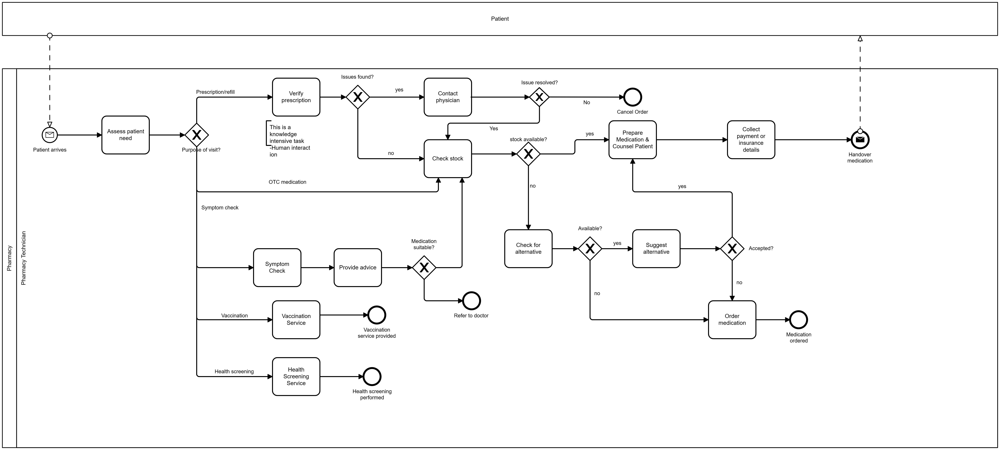

### Patient Arrival

The process begins when the patient arrives at the pharmacy. The pharmacy technician receives the patient and initiates the service interaction.

### Assessment of Patient Needs

The pharmacy technician assesses the purpose of the patient’s visit. Based on the patient’s needs, the process follows one of the following paths:

- Prescription or refill
- Over-the-counter (OTC) medication request
- Symptom assessment
- Vaccination service
- Health screening

#### Prescription or Refill

The technician checks the prescription, which is considered a knowledge-intensive task requiring human evaluation. If issues are found, the pharmacy contacts the prescribing physician to resolve them. Should the issues persist, the order is canceled and the process ends. Should the issues be resolved, the process continues and the stock gets checked. If no issues are found, the technician proceeds directly to check the stock.

If the medication is available, the technician prepares the medication. Otherwise, the stock gets checked for alternative options and if the patient accepts the alternative, the medication is prepared. After the patient provides payment or insurance details, the pharmacy technician proceeds with the counselling and hands the medication over to the patient. With this, the process ends. If the alternative is rejected or no suitable alternative exists, the original medication is ordered and the process ends after ordering.

#### OTC Medication or Symptom Assessment

The pharmacy technician assesses the patient’s symptoms to recommend suitable OTC products or advice. Based on symptom evaluation, the technician offers guidance or product recommendations. If the recommended medication is suitable, the process ends. Otherwise, the patient is referred to a doctor for further examination.

#### Vaccination Service

The technician administers the vaccination. Once the vaccination is provided, the process ends.

#### Health Screening
The technician performs the requested screening service. After the completion of the screening, the process ends.   

## To-Be Process
### End-to-End Process View


This BPMN process model is a visual, end-to-end representation of the digital pharmacy process across multiple participants and systems. It is not the executable workflow model implemented in Camunda. Instead, it is meant to illustrate how the overall process flows from the customer-facing digital experience through pharmacy operations, including steps that may be handled by external systems, manual activities, or integrations that are outside of Camunda’s scope. 

The following sections provide a detailed walkthrough of each workflow.

### Camunda Workflow

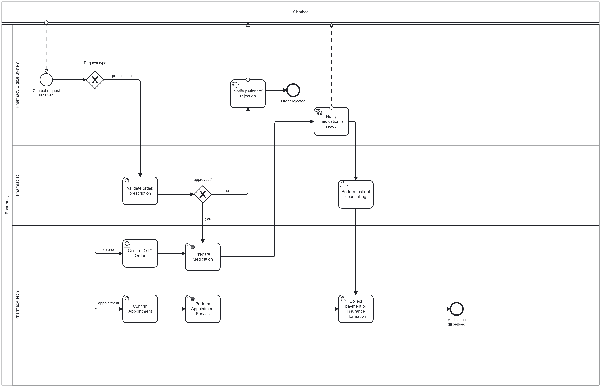

The Camunda workflow starts when the Pharmacy Digital System (Camunda) receives the request from the patient from via chatbot. Based on the request type, the process continues with one of three flows: Prescription medication ordering, OTC order, or appointment scheduling.

#### Prescription medication ordering   
A prescription uploaded by the patient via the chatbot is validated by the pharmacist. If the prescription is rejected, the patient is notified by the Pharmacy Digital System and the process ends. If it is approved, the pharmacy technician prepares the medication. Once preparation is complete, the patient is notified that the medication is ready for pickup. The pharmacist then provides patient counselling. After payment is collected or insurance information is confirmed, the medication is dispensed and the process ends.

#### OTC order  
The patient requests over-the-counter (OTC) medication via the chatbot. The pharmacy technician confirms the OTC order and prepares the medication. When preparation is complete, the patient is notified that the medication is ready for pickup. The pharmacist provides patient counselling. After payment is collected or insurance information is confirmed, the medication is dispensed and the process ends.

#### Appointment scheduling  
The patient requests an appointment via the chatbot. The pharmacy technician confirms the appointment and the service is performed. Afterwards, payment is collected or insurance information is confirmed, and the process ends.

### ChatBot

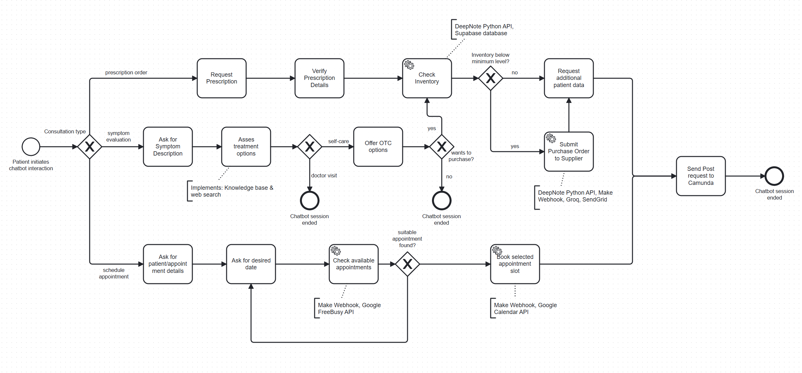

#### Conversation Start 

The process starts when a patient initiates a chatbot interaction. The chatbot then routes the conversation based on the request type into one of three flows: prescription order, symptom evaluation, or appointment scheduling.  

#### Prescription order

The chatbot requests the prescription and then verifies the prescription details. Next, the system checks inventory (via DeepNote Python API and a Supabase database). If the inventory is below the minimum level, the system submits a purchase order to the supplier (via DeepNote Python API, Make Webhook, Groq, SendGrid). If the inventory is not below the minimum level, the process continues without submitting a supplier order. In both cases, the chatbot then requests additional patient data. Once the required data is collected, the system sends a POST request to Camunda.  

#### Symptom evaluation

The chatbot asks the patient for a symptom description and then assesses treatment options. If the assessment concludes that a doctor visit is necessary, the conversation ends (the chatbot recommends seeking medical care). Otherwise, the symptoms are assessed to be treatable by self-care and the chatbot offers OTC options. After the OTC options are presented, the chatbot asks whether the patient wants to purchase the medication. If not, the process ends, otherwise the chatbot continues with checking the inventory (via DeepNote Python API + Supabase). If the inventory is below minimum, the chatbot submits a purchase order to the supplier (via DeepNote Python API, Make Webhook, Groq, SendGrid). Either way, the chatbot then requests additional patient data and finally sends a POST request to Camunda.  

#### Appointment scheduling

The chatbot collects the patient/appointment details and then asks for the desired date. The system then checks available appointments (via Make Webhook + Google FreeBusy API). If a suitable appointment is found, the system books the selected appointment slot (via Make Webhook + Google Calendar API) and then sends a POST request to Camunda. If no suitable appointment slot can be found, the patient is asked to enter another date/time for the appointment.

### Knowledge Base (KB)
<p align="center">
  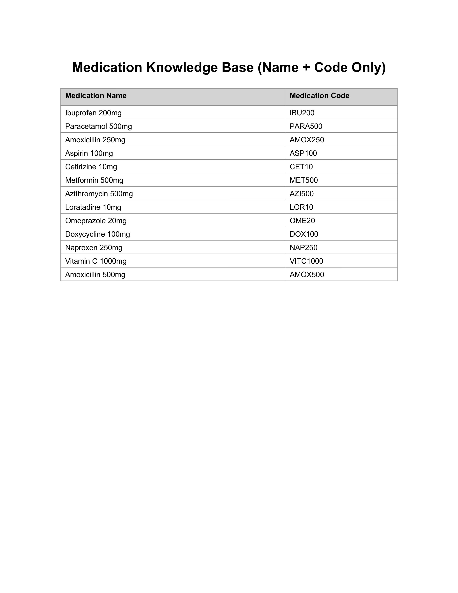
  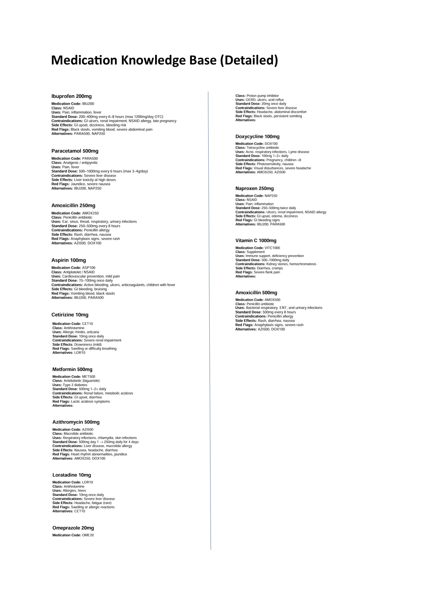
</p>

#### KB Purpose
The medication KB serves as structured reference that enables the chatbot to provide safe, consistent, and context-aware medication guidance. It contains information on a predefined list of medications, including medication names, unique medication codes (for database identification), indications, dosing guidelines, side effects, contraindications, red flags, and approved alternatives. 

By using the KB, the chatbot can: 
- Recommend appropriate OTC medications when suitable
- Identify situations where medical evaluation is required instead of self-treatment
- Extract and pass standardized medication codes to other systems for inventory checks and process automation

### Booking Appointment

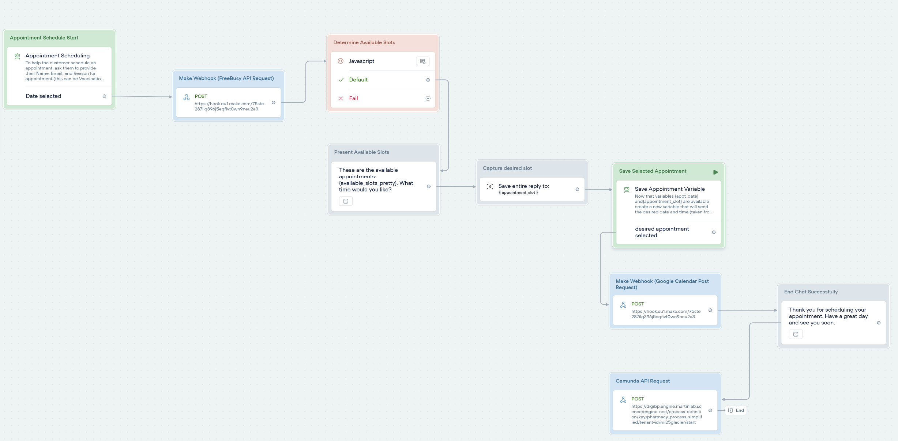

- Chatbot Agent asks patient for their information: name, email, reason for appointment (can select from Vaccination, Consultation, or Health Screening).
- API request is sent to Make webhook a list of booked appointments
- Javascript code block determines the available appointments based on working hours, appointment intervals (30 min per appointment), and the list of booked appointments. 
- List of available appointments is presented to the customer
- Customer selects a date or asks for a different date
- Selected appointment slot is saved to Google Calendar with Make Webhook
- Chat ends and appointment details are sent to Camunda via API request

### Symptom Evaluation and OTC order


#### Symptom Evaluation Agent Prompt
Using the available KB and a web search, the agent will either recommend self-treatment using OTC medication or a medical evaluation by a medical professional. The following prompt was used to help the agent make the triage decision: [Symptom Evaluation Prompt (PDF)](supplementarydocs/symptomevalprompt.pdf)

- Agent asks customer to describe symptoms
- Based on description, a triage decision is made
- If self=treatment is made, Inventory API is called to check if available and place purchase order in case stock is below the minimum level
- Agent provides information about the medication (safety, usage, etc.) and then requests customer information (name, email, dob, etc.) to place the order. Once obtained, the order is submitted.
- POST request is sent to Camunda with order details
- Chat ends

### Prescription Medication Order

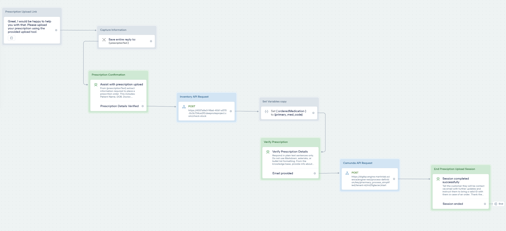

- Chatbot prompts customer to upload prescription using provided tool
- Uploaded document is sent to OCR.space via API Request, which extracts the prescription details using Optical Character Recognition
- Information is sent back to Voiceflow and the user confirms it is correct
- API Request is sent to database to check inventory (and place purchase order if necessary)
- Agent block provides relevant information about the medication and asks user to provide their email to process the order
- API Request sends order information to Camunda and process finishes

## Camunda Workflow
Need to insert camunda workflow images for forms, variables received from voiceflow

## Make Webhooks
### Purchase Order
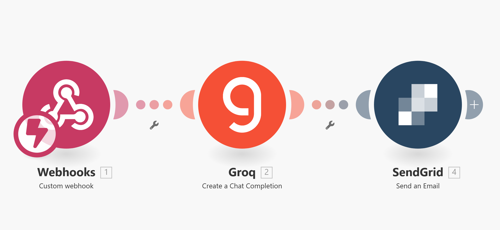

It utilizes Groq for high-speed AI inference to generate professional, context-aware Purchase Order (PO) emails, ensuring vendors receive clear and accurate demands immediately.

- Trigger: When the system checks the stock, in parallel, it checks if the medication reorder level has been reached. The system then sends a JSON payload containing the specific medication details, the quantity needed, and supplier contact information.

- Processing:  The system utilizes the Groq API (likely running Llama 3 or Mixtral) to draft a formal business email.

- Action: The generated email body is transmitted to the supplier's registered email address.

The Groq LLM is configured with a system prompt designed for professional business communication.

> Write a professional pharmacy reorder email to {{1.supplierName}}.
>
>   Details:
>   - Medication: {{1.medicationName}} (Code: {{1.medCode}} )
>   - Current stock: {{1.currentStock}}
>   - Needed Quantity :{{1.neededQuantity}}
> - Status: {{1.status}}
>
>     Requirements:
>     - Professional pharmacy tone
>     - Highlight Code number prominently
>     - Request urgent delivery
>     - Include clear call-to-action
>     - Compliance-appropriate format
>
>     Return ONLY the email body, no subject line.


### Appointment Scheduling

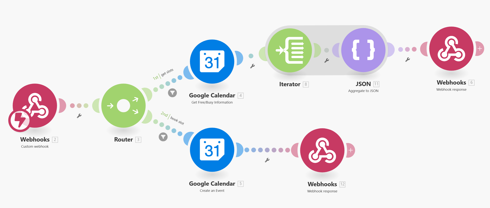
**Voiceflow sends API request to webhook. Routed based on the required "action" (either get slots or book slot). 

Get Slots Route (when "action" = get slots): 
- Google calendar FreeBusy API is called and returns an array with booked appointments
- An Iterator is used to convert the result array into a series of bundles
- JSON Aggregator combines the data bundles from the Iterator Module into a single, structured JSON object with keys "Start" and "End" for each bundle
- The webhook response sends this JSON array back to Voiceflow

Book Slots (when "action" = book slots):
- Voiceflow passes appointment details to webhook (name, email, type, date/time) and Google Calendar API is called to create the appointment
- If successful, a summary is sent back to Voiceflow in the webhook response

need to add explanation

### Patient Email Notification

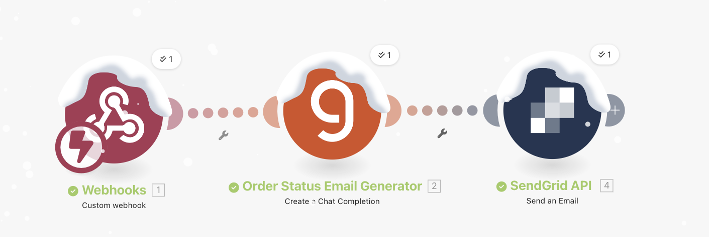

The core logic dynamically handles two distinct scenarios:
- Order Confirmation: Notifying patients that their medication is being prepared.
- Order Rejection: Empathetically informing patients of declined orders and advising next steps.

The pipeline consists of three synchronous stages:
- Ingestion (Webhook): Receives real-time patient and order payloads from Camunda.
- Processing (LLM Inference): Uses OpenAI to interpret the is_rejected boolean flag and generate the appropriate email body.
- Delivery (SendGrid): Dispatches the formatted email to the patient.

The AI Agent (OpenAI Chat Completion) acts as the logic router and content writer. It relies on the following system prompt structure:
  >You are a system that generates transactional healthcare emails.
  >
  >Generate a professional email using the input below.
  >
  >Input:
  >{
  >  "patientName": {{1.patientName}},
  >  "orderedMedicationName": {{1.orderedMedicationName}} ,
  >  "is_rejected": {{1.is_rejected}},
  >  "pharmacist_comment" {{1.pharmacistComment}}
  >
  >Rules:
  >- Use a polite and neutral tone.
  >- Do NOT include medical advice.
  >- Address the patient by name.
  >- Keep the message concise.
  >- End with "The Pharmacy Team".
  >- Output plain text only.
  >- Do not add a subject line.
  >
  >If is_rejected = "yes":
  >- Clearly state that the order could not be approved.
  >- Do not use apologetic or emotional language.
  >
  >If is_rejected = "no":
  >- Clearly state that the order has been confirmed and is being processed.
  
## Database

This database module tracks current stock levels (pharmacy_inventory), manages vendor relationships (suppliers), and maintains a historical audit trail of stock replenishment (reorder_history). It is designed to support automated reordering and inventory valuation.

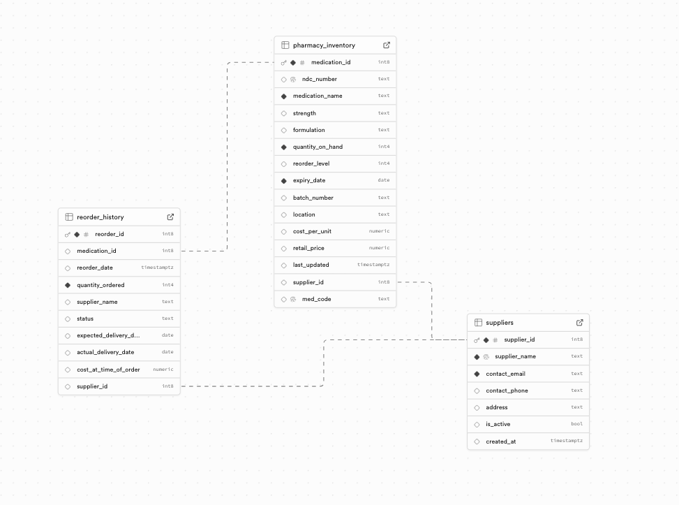

### A. pharmacy_inventory
- Purpose: The central table containing the current state of all medications in stock.
- Primary Key: medication_id (int8)
- Key Attributes:
    - quantity_on_hand and reorder_level (triggers for restocking).
    - medication_name, strength, formulation, med_code.
    - expiry_date and batch_number for safety tracking.
    - cost_per_unit and retail_price.
    - Foreign Key: supplier_id (Links to the preferred vendor).
### B. suppliers
- Purpose: A directory of pharmaceutical vendors and distributors.
- Primary Key: supplier_id (int8)
- Key Attributes:
    - supplier_name, is_active (boolean flag for valid vendors).
    - contact_email, contact_phone, address.
### C. reorder_history
- Purpose: A transactional log of all procurement orders placed with suppliers.
- Primary Key: reorder_id (int8)
- Key Attributes:
    - reorder_date, expected_delivery_date, actual_delivery_date.
    - quantity_ordered, status (e.g., Pending, Received), cost_at_time_of_order.
    - Links to both medication_id (what was bought) and supplier_id (who sold it).
### Entity Relationships
- Inventory to Supplier:
  - pharmacy_inventory.supplier_id → suppliers.supplier_id
- History to Inventory:
  - reorder_history.medication_id → pharmacy_inventory.medication_id
- History to Supplier:
  - reorder_history.supplier_id → suppliers.supplier_id


## API Endpoints


- ### Health Check
  
  **GET /**  
  
  Returns the API status and version.  
  
  **Response:**  
  
  ```
  {
  "status": "active",
  "version": "1.0"
  }
  ```


- ### Check Stock
  
  **POST /check-stock**  
  
  Checks if sufficient stock is available for a medication. Automatically triggers reorder checks in the background if stock is low.  
  
  **Request Body:**  
  
  ```
  {
  "med_code": "MED123",
  "needed_quantity": 10,
  "alternative_med_code": "MED456",
  "reorder_threshold_override": 15
  }
  ```
  
  **Parameters:**  
- `med_code` (required) - Medication code to check
- `needed_quantity` (required) - Quantity needed (must be > 0)
- `alternative_med_code` (optional) - Alternative medication if primary is unavailable
- `reorder_threshold_override` (optional) - Override default reorder threshold
  
  **Response:**  
  
  ```
  {
  "stockStatus": "OK",
  "quantityOnHand": 50,
  "neededQuantity": 10,
  "sufficientStock": true,
  "medicationName": "Aspirin 500mg",
  "medCode": "MED123",
  "supplierName": "PharmaCorp",
  "supplierEmail": "orders@pharmacorp.com",
  "message": null
  }
  ```
  
  **Status Values:**  
- `OK` - Sufficient stock available
- `Alternative Available` - Primary stock insufficient, alternative provided
- `Insufficient Stock` - Neither primary nor alternative have sufficient stock


- ### Dispense Medication
  
  **POST /dispense**  
  
  Dispenses medication and updates inventory. Triggers background reorder check if needed.  
  
  **Request Body:**  
  
  ```
  {
  "medication_name": "Ibuprofen 200 mg",
  "quantity": 2
  }
  ```
  
  **Parameters:**  
- `medication_name` (required) - Medication name to dispense
- `quantity` (required) - Quantity to dispense (must be > 0)
  
  **Response:**  
  
  ```
  {
  "status": "Dispensed",
  "medication_name": "Ibuprofen",
  "new_quantity": 45
  }
  ```


- ### Receive Shipment
  
  **POST /receive-shipment**  
  
  Marks a reorder as received and updates inventory accordingly.  
  
  **Request Body:**  
  
  ```
  {
  "reorder_id": 123,
  "quantity_received": 50
  }
  ```
  
  **Parameters:**  
- `reorder_id` (required) - ID of the reorder to mark as received
- `quantity_received` (required) - Quantity received (must be > 0)
  
  **Response:**  
  
  ```
  {
  "status": "Stock Updated",
  "message": "Order marked as Received and inventory updated."
  }
  ```
  
  **Error Cases:**  
- `400` - Reorder ID not found, already processed, or medication not found


- ### Reorder Alert Payload
  
  When stock is low, the system sends a webhook to the configured `MAKE_WEBHOOK_URL`:  
  
  ```
  {
  "type": "Low Stock Alert",
  "medicationName": "Aspirin 500mg",
  "medCode": "ASP500",
  "currentStock": 3,
  "reorderLevel": 5,
  "supplierName": "PharmaCorp",
  "supplierEmail": "orders@pharmacorp.com",
  "status": "Urgent"
  }
  ```


- ### Reorder duplicates mechanism 
  
  The system prevents duplicate reorders by:  
- Checking for active orders (status not "Received" or "Cancelled")
- Creating a reorder history entry when alert is sent
- Skipping reorder checks if an active order exists


- ## Key Functions
- ### Database Operations
- `get_medication(med_code)` - Retrieves medication details with supplier info
- `get_supplier_info(inventory_record)` - Extracts supplier details
- `has_sufficient_stock(medication, needed_qty)` - Checks stock availability
- `update_stock_quantity(med_code, quantity_change)` - Updates inventory via RPC
- `has_active_reorder(medication_id)` - Checks for pending orders
- `log_reorder_event(medication, quantity)` - Creates reorder history entry
- `mark_order_received(reorder_id, qty_received)` - Processes shipment receipt
- ### Reorder Logic
- `send_reorder_alert(medication, threshold)` - Sends webhook notification
- `check_reorder_needed(med_code, threshold_override)` - Evaluates reorder conditions

## Notes  
- Background tasks run asynchronously without blocking responses
- All stock updates are performed atomically via database RPC
- Default reorder quantity is set to 50 units
- Webhook requests timeout after 5 seconds